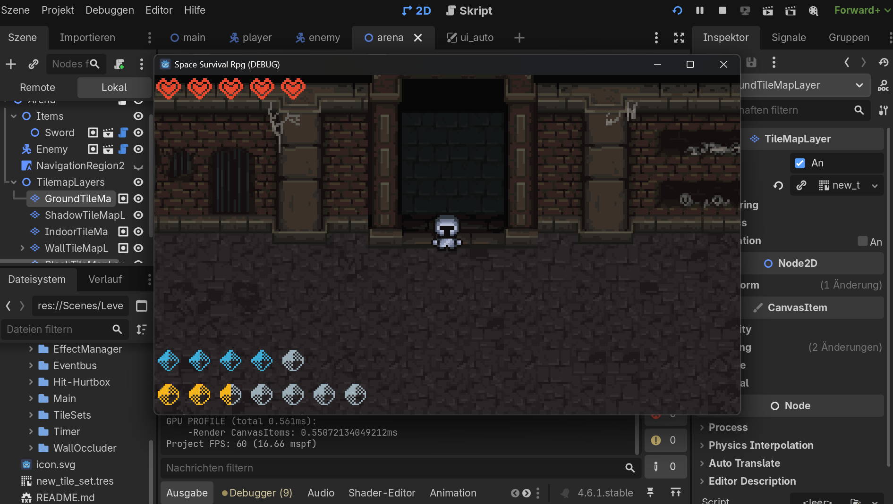
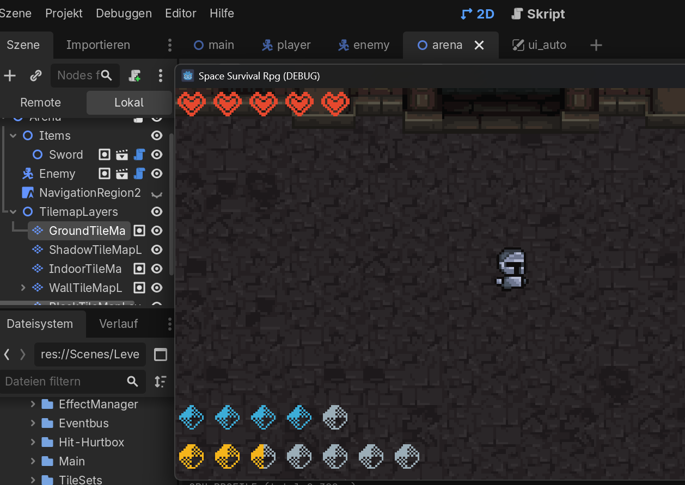
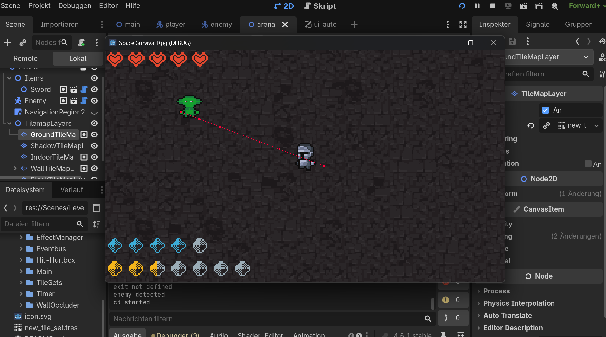
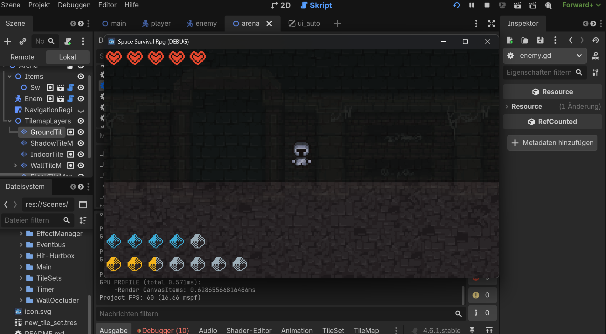
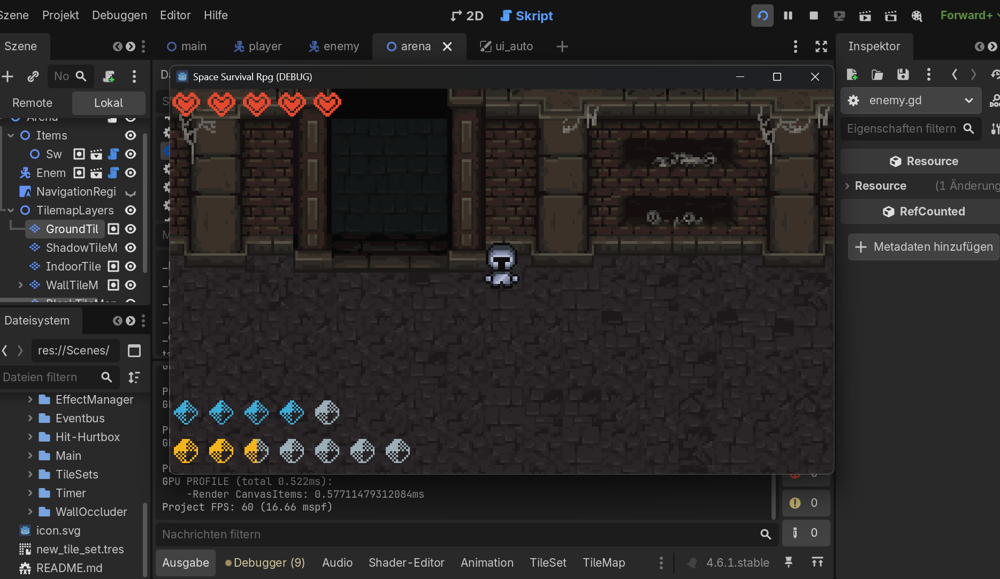
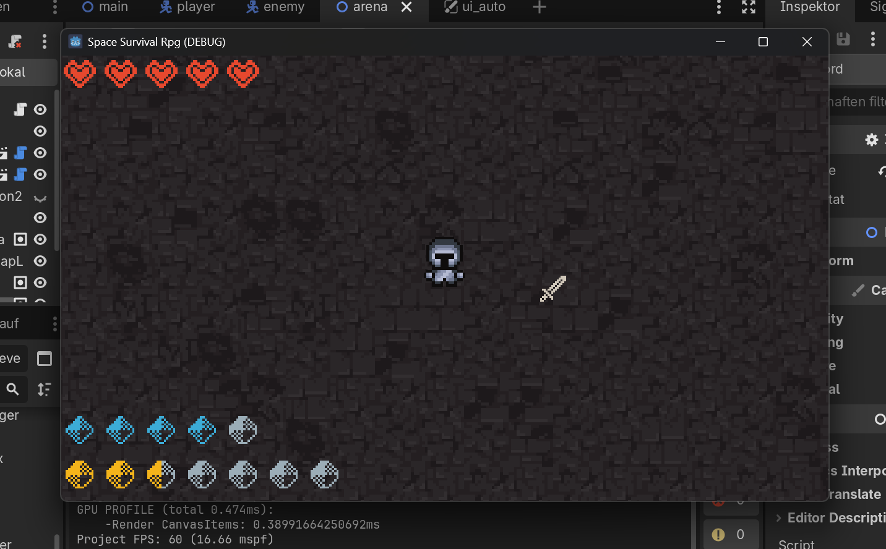
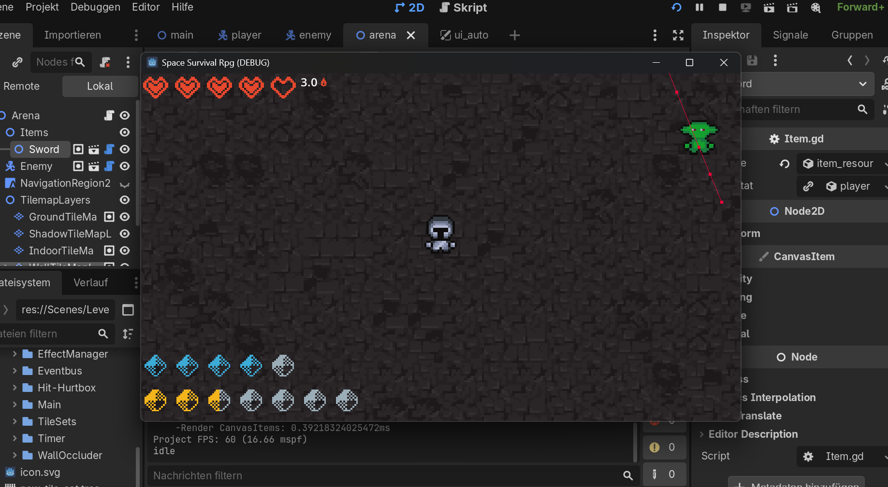
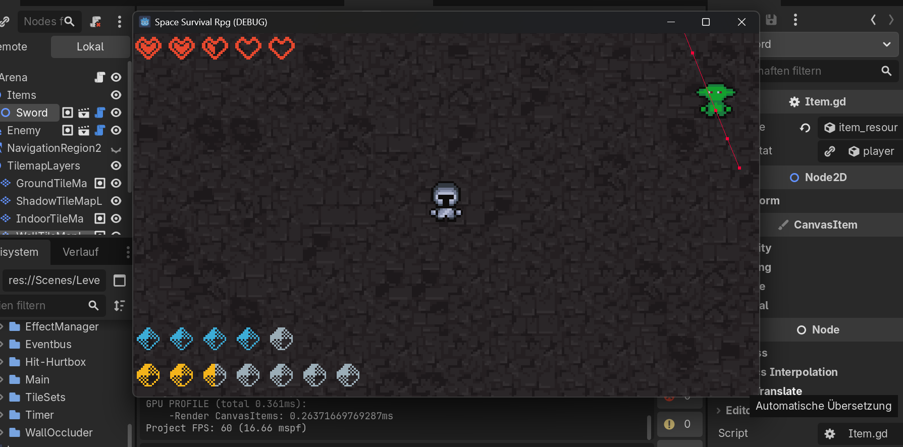
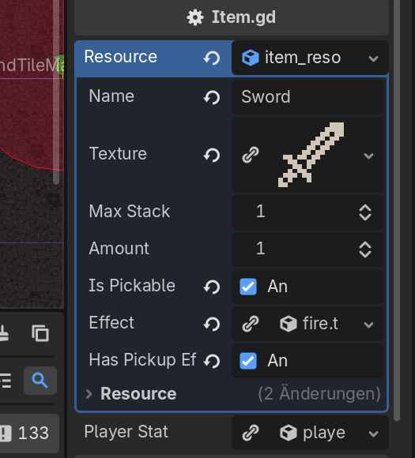

# 2D Game Project

In keiner weise ein vollständiges Spiel. Eher eine Verkettung von mehreren Game-Systems, die ich in meiner Freizeit mit Godot gecoded habe.

## Einige Features:
### Inventar System
- funktionelles Inventar-System, mit tauschbaren Items, Item-Pickup, Item-Stacking und Max-Stacks pro Slot
- Zusätzliche Inventare für Kisten inkl. Item-Transfer zwischen den Intenvaren

### UIs
#### Health-UI
- Anzahl an Herzen wird anhand der Max-HP des Spielers gesetzt
- Anzahl voller Herzen wird anhand von Current-HP gesetzt
- Tracking der Spieler-HP und verlieren von Herzen, wenn Spieler-Hitbox betreten wird
- Herzen wiederherstellen, durch Healing-effekt (über Zeit oder direkt)

#### Stamina/Mana-UI
- Ähnliche Initializierung, wie bei HP
- Tracking der aktuellen und Max-Werte
- Verlust/Wiederherstellung der Werte durch Items/über Zeit

#### Effekt-UI
- Funktionales Effekt-UI, welches Effekte tracked, das entsprechende Symbol + Zeit setzt, den Effekt anwendet und den Effekt nach Ablauf der Zeit wieder entfernt

### Gegner
- "Ork-Gegner", welcher den Spieler anhand vom AStar-2D Pathfinding Algorythmus verfolgt, solange er sich innerhalb der Detection-Zone aufhält
- Gegner greift den Spieler an, wenn dieser sich in der Hurtbox des Gegners befindet
- Gegner verfolgen den Spieler bis zum letzten, gesehenen Punkt, wenn sie Sichtkontakt verlieren
- Gegner ist nicht in der Lage den Spieler durch Wände zu sehen oder zu verfolgen

### Spieler
- Selbsterstellte Spieler und Rüstungssprites für alle 4 Richtungen
- Verschiedene Animationen für alle 4 Richtungen
- Walk-, Idle- und Attack-Animationen
- Funktionierende Health-, Mana- und Staminabar
- Funktionales Effekt-System
- Teil-Implementiertes Skill-System, welches dem Spieler erlaubt verschiedene Skills zu verwenden

### Items
- Verschiedene Item-Templates sind schon integriert
- Ein Schwert, welches beim aufheben dem Spieler Schaden macht
- und ein Schild, welches den Spieler heilt
- Items sind aufnehmbar, haben verschiedene (overtime) Effekte, Stack-Sizes und Gruppen
- Items sind so angelegt, dass sie schnell, mit nur wenigen Handgriffen implementiert werden können und der Code wiederverwendbar ist

### Kisten
- Es gibt eine Kiste, welche man öffnen kann, wenn man sich nahgenug an dieser befindet
- Die Kiste öffnet ein seperates Inventar, diese enthält ein Schwert, welches man zwischen seinem eigenen Inventar und der Kiste hin- und her schieben kann

### Layers
- Es gibt verschiedene Layers, welche eine Art 3D Effekt erstellen sollen
- Spieler können quasi "in Gebäude hinein gehen"
- Gebäude sind nicht von aussen/oben einsehbar, werden aber sichtbar sobald man sich in ihnen befindet
- von außen sind Wände undurchsichtig, befindet man sich allerdings hinter der Wand wird diese Semi-Transparent

### Generell
Generell habe ich versucht viel Wert darauf zu legen Klassen und Objekte so anzulegen, dass sie wiederverwendbar und multi-purpose sind.
So lässt sich zb der Ork ganz leicht durch einen anderen Gegner austauschen, welcher komplett andere Attribute haben kann.
Auch die Items lassen sich in wenigen Handschlägen erstellen und sind, aufgrund ihrer vererbten Eigenschaften vielseitig einsetzbar.

